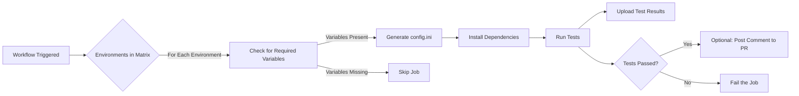

# TM1Py GitHub Actions CI Pipeline

## Overview

We have implemented a continuous integration (CI) pipeline using GitHub Actions to automate the testing of TM1Py pull requests. This pipeline ensures that code changes are thoroughly tested across multiple TM1 environments before being merged. The key features of this new setup include:

- **Automated Testing**: Runs tests automatically for all defined TM1 environments whenever the workflow is triggered.
- **Dynamic Configuration**: Generates `config.ini` files dynamically based on environment-specific variables and secrets.
- **Parallel Execution**: Executes tests in parallel across different environments, ensuring efficient use of resources.
- **Secure Handling of Secrets**: Manages sensitive information securely using GitHub Environments and Secrets.

---

## Workflow Description

The new GitHub Actions workflow:

- **Identifies All Defined Environments**: Automatically attempts to run tests for all environments specified in the workflow matrix.
- **Checks for Required Variables**: Skips environments where the necessary variables (`TM1_CONNECTION` and `TM1_CONNECTION_SECRET`) are not defined.
- **Generates Configuration Files**: Creates a `config.ini` file for each environment using environment-specific variables and secrets.
- **Runs Tests in Isolation**: Executes tests for each environment in isolated runners to prevent interference.
- **Reports Results**: Uploads test results and, optionally, posts comments to pull requests with test outcomes.

---

## Architecture and Flow Diagram

Below is a flow diagram illustrating the CI pipeline's architecture and execution flow:



- **A**: The workflow is triggered manually or by an event (e.g., pull request).
- **B**: The workflow defines a matrix of environments to test.
- **C**: Each job checks if the required variables are present.
- **D**: If variables are present, `config.ini` is generated.
- **E**: If variables are missing, the job is skipped.
- **F**: Dependencies are installed, including any extras needed for testing.
- **G**: Tests are run using `pytest`.
- **H**: Test results are uploaded as artifacts.
- **I**: Checks if tests passed.
- **J**: Optionally posts a comment to the pull request with results.
- **K**: The job fails if tests did not pass.

---

## Repository Setup

### 1. Defining Environments

Create GitHub Environments for each TM1 instance/version you want to test against (there is no expected naming conversion):

- **Environments**:
  - `tm1-11-onprem`
  - `tm1-11-cloud`
  - `tm1-12-mcsp`
  - `tm1-12-paaas`
  - `tm1-12-onprem`

### 2. Setting Environment Variables and Secrets

For each environment, define the necessary variables and secrets (naming on the variables MUST be respected):

- **Variables (`vars`)**:
  - `TM1_CONNECTION`: A JSON string with non-sensitive connection parameters.

- **Secrets (`secrets`)**:
  - `TM1_CONNECTION_SECRET`: A JSON string with sensitive connection parameters (e.g., passwords, API keys).

#### Sample Variables and Secrets for multiple types of environments

**Environment:** `tm1-11-onprem`

- **Variable (`TM1_CONNECTION`):**

  ```json
  {
    "address": "localhost",
    "port": "8001",
    "user": "admin",
    "ssl": "true",
    "session_context": "gh_unittest"
  }
  ```

- **Secret (`TM1_CONNECTION_SECRET`):**

  ```json
  {
    "password": "apple"
  }
  ```

**Environment:** `tm1-11-cloud`

- **Variable (`TM1_CONNECTION`):**

  ```json
  {
    "base_url": "https://server.planning-analytics.ibmcloud.com/tm1/api/tm1",
    "user": "server01_tm1_automation",
    "namespace": "LDAP",
    "ssl": true,
    "verify": true,
    "async_requests_mode": true,
    "session_context": "gh_unittest"
  }
  ```

- **Secret (`TM1_CONNECTION_SECRET`):**

  ```json
  {
    "password": "<NonInteractiveAccountPwd>"
  }
  ```

**Environment:** `tm1-12-mscp`

- **Variable (`TM1_CONNECTION`):**

  ```json
    {
        "base_url": "https://us-east-1.planninganalytics.saas.ibm.com/api/<TenantId>/v0/tm1/<DatabaseName>/",
        "user": "apikey",
        "password": "<TheActualApiKey>",
        "async_requests_mode": true,
        "ssl": true,
        "verify": true,
        "session_context": "gh_unittest"
    }
  ```

- **Secret (`TM1_CONNECTION_SECRET`):**

  ```json
  {
    "password": "<TheActualApiKey>"
  }
  ```

### 3. Workflow File

Create a workflow file `.github/workflows/tm1py-integration-tests.yml` with the following content:

```yaml
name: TM1Py Integration Tests

on:
  workflow_dispatch:
    inputs:
      environments:
        description: 'JSON array of environments to test (e.g., ["tm1-11-onprem", "tm1-11-cloud"])'
        required: true
        default: '["tm1-11-onprem","tm1-11-cloud","tm1-12-mcsp"]'

jobs:
  test:
    runs-on: ubuntu-latest
    strategy:
      matrix:
        environment: ${{ fromJson(github.event.inputs.environments) }}
    environment: ${{ matrix.environment }}
    steps:
      - name: Checkout code
        uses: actions/checkout@v3

      - name: Set up Python
        uses: actions/setup-python@v4
        with:
          python-version: '3.x'

      - name: Install dependencies
        run: |
          pip install -e .[unit_test]

      - name: Retrieve TM1 Connection Details
        id: get-connection
        run: echo "Retrieving TM1 connection details"
        env:
          TM1_CONNECTION: ${{ vars.TM1_CONNECTION }}
          TM1_CONNECTION_SECRET: ${{ secrets.TM1_CONNECTION_SECRET }}

      - name: Generate config.ini
        run: |
          python Tests/resources/generate_config.py
        env:
          TM1_CONNECTION: ${{ vars.TM1_CONNECTION }}
          TM1_CONNECTION_SECRET: ${{ secrets.TM1_CONNECTION_SECRET }}

      - name: Run tests
        run: pytest Tests/

      - name: Upload test results
        if: always()
        uses: actions/upload-artifact@v3
        with:
          name: test-results-${{ matrix.environment }}
          path: Tests/test-reports/

      # Optional: Post results to PR
      - name: Post comment to PR
        if: always() && github.event_name == 'workflow_dispatch' && github.event.pull_request
        uses: actions/github-script@v6
        with:
          script: |
            github.rest.issues.createComment({
              owner: context.repo.owner,
              repo: context.repo.repo,
              issue_number: context.payload.pull_request.number,
              body: 'Tests completed for environment: ${{ matrix.environment }}. Check artifacts for details.'
            })
```

---

## Parallel Execution of Multiple Environments

### How It Works

- **Matrix Strategy**: The workflow uses a matrix strategy to define jobs for each environment.
- **Parallel Jobs**: Each environment runs in its own job, which can execute in parallel with others.
- **Isolation**: Jobs are isolated from each other, each with its own runner and workspace.

### Ensuring Isolation

- **Separate Runners**: Each job runs on a separate virtual machine provided by GitHub Actions.
- **Unique Workspaces**: Each job has its own workspace and filesystem.
- **Environment Variables and Secrets**: Scoped to each job's environment, ensuring no cross-contamination.

### Benefits

- **Efficiency**: Tests for different environments run simultaneously, reducing total execution time.
- **No Interference**: Jobs do not interfere with each other, preventing conflicts in configuration files or resources.
- **Scalability**: Easily add or remove environments without affecting the workflow's structure.

---

## Additional Information

### Generating `config.ini`

A script `Tests/resources/generate_config.py` is used to create the `Tests/config.ini` file dynamically:

```python
import json
import os

tm1_connection = os.environ.get('TM1_CONNECTION')
tm1_connection_secret = os.environ.get('TM1_CONNECTION_SECRET')

config_content = '[tm1srv01]\n'

if tm1_connection:
    conn_data = json.loads(tm1_connection)
    for key, value in conn_data.items():
        config_content += f"{key}={value}\n"

if tm1_connection_secret:
    secret_data = json.loads(tm1_connection_secret)
    for key, value in secret_data.items():
        config_content += f"{key}={value}\n"

with open('Tests/config.ini', 'w') as f:
    f.write(config_content)
```

### Updating `setup.py`

Ensure that all necessary dependencies are included:

```python
install_requires=[
    'ijson',
    'requests',
    'pytz',
    'requests_negotiate_sspi;platform_system=="Windows"',
    'mdxpy>=1.3.1'],
extras_require={
    "pandas": ["pandas"],
    "dev": [
        "pytest",
        "pytest-xdist"
    ],
    "unit_test": [
        "pandas",
        "pytest",
        "pytest-xdist",
        "python-dateutil"
    ]
},
```

### Security Considerations

- **Secrets Management**: Use GitHub Secrets to store sensitive information securely.
- **Access Control**: Secrets are only available to jobs that specify the corresponding environment.
- **Prevent Exposure**: Ensure that secrets are not printed in logs or exposed in any artifacts.

### Best Practices

- **Testing in Isolation**: Each test run is isolated to prevent interference between environments.
- **Resource Management**: Be mindful of GitHub Actions' concurrency limits and manage environments accordingly.
- **Documentation**: Keep documentation updated to reflect changes in the CI pipeline and testing procedures.

---

## Further Reading

- [GitHub Actions Documentation](https://docs.github.com/en/actions)
- [TM1Py Documentation](https://tm1py.readthedocs.io/en/latest/)
- [Python Packaging Guide](https://packaging.python.org/tutorials/packaging-projects/)
- [Secure Secrets Management in GitHub Actions](https://docs.github.com/en/actions/security-guides/encrypted-secrets)

---

**Note**: Remember to keep your repository's documentation up to date with these changes, and communicate with your team to ensure everyone is aware of the new testing procedures.